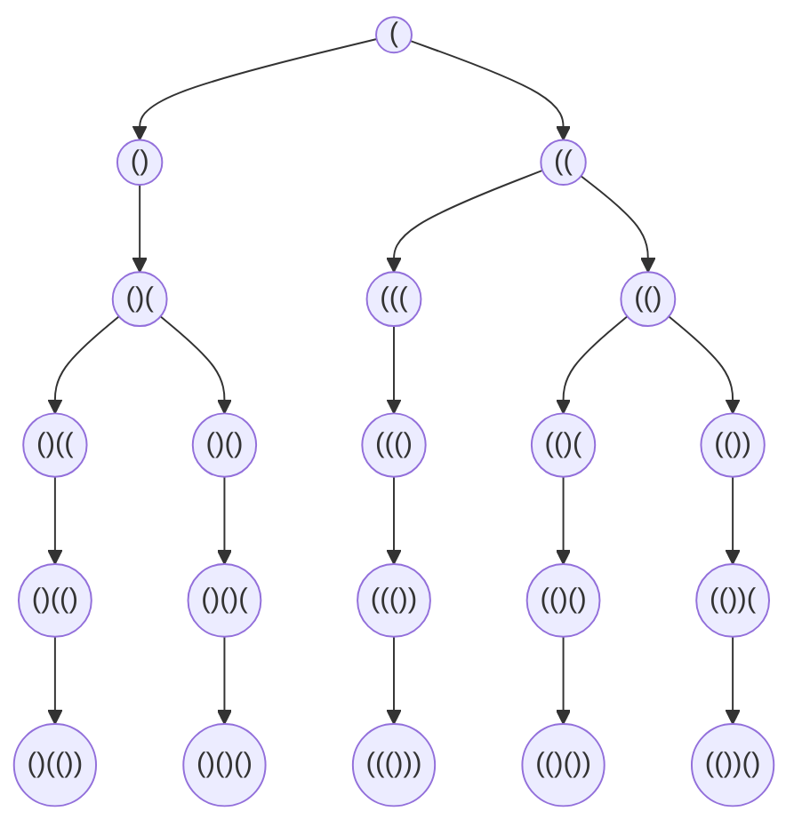

# [Generate Parentheses](https://leetcode.com/problems/generate-parentheses/)
---
Tags: [[Stacks]], [[Backtracking]], [[Dynamic Programming]]
Difficulty: **Medium**
Date completed: 09-10-2023 12:02

---
## Problem
<iframe width="560" height="315" src="https://www.youtube.com/embed/s9fokUqJ76A?si=BYc8TsGASaK8cqF2" title="YouTube video player" frameborder="0" allow="accelerometer; autoplay; clipboard-write; encrypted-media; gyroscope; picture-in-picture; web-share" allowfullscreen></iframe>
Given `n` pairs of parentheses, write a function to _generate all combinations of well-formed parentheses_.
### Examples
**Example 1:**
**Input:** n = 3
**Output:** ["((()))","(()())","(())()","()(())","()()()"]

**Example 2:**
**Input:** n = 1
**Output:** ["()"]
### Constraints
- `1 <= n <= 8`
---
## Intuition
- Use recursion to navigate possibilities
- Use stack to store values until end is reached
- Append the full stack to result

Example for n = 3

## Approach
1. Initialise the stack and result array
2. Create recursion function including base case, adding opening and closing parentheses
3. Call backtracking function with original values
4. Return results
### Complexity
- Time complexity:
- Space complexity:
## Code

```Python
def generateParentheses(n: int) -> List[str]:
	stack = []
	res = []

	def backtrack(open_count,closed_count):
		if open_count == closed_count == n:
			res.append("".join(stack))
			return

		if open_count < n:
			stack.append("(")
			backtrack(open_count + 1, closed_count)
			stack.pop()

		if closed_count < open_count:
			stack.append(")")
			backtrack(open_count,closed_count + 1)
			stack.pop()

	backtrack(0,0)
	return res
```